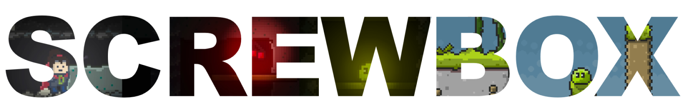

# ScrewBox
 

Minimalist 2d Java game engine.

  

## Current status

ScrewBox is a personal pet project since februrary 2021.

## Libraries used
- JUnit5: [Eclipse Public License 2.0](https://github.com/junit-team/junit5/blob/main/LICENSE.md)
- FasterXML Jackson Core [Apache License 2.0](https://github.com/FasterXML/jackson-core/blob/2.14/LICENSE)
- AssertJ [Apache License 2.0](https://github.com/assertj/assertj-core/blob/main/LICENSE.txt)
- Mockito [MIT License](https://github.com/mockito/mockito/blob/main/LICENSE)

## Acknowledgments
The project idea was inspired by Gurkenlabs [Litiengine](https://github.com/gurkenlabs/litiengine).
