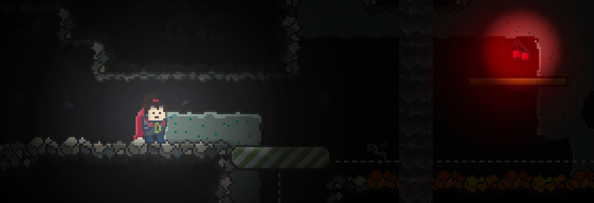

# ScrewBox
 

Minimalist 2d Java game engine. Result of covid lockdown.

  

## Current status
ScrewBox is a personal pet project since february 2021. It has no constant commits and has not been released yet. If you want to know what this can do. Download into your workspace and start `DeboApplication`. Enjoy!

## Features
- **Entity Component System** Add and remove game objects and behaviour. Save and load the game state.
- **Render Engine** Fast rendering of basic shapes, animated graphics and text. Enhance graphics with dynamic light and shadow effects.
- **Physics System** Apply movement to objects. Resolve collisions. Detect objects via raycasting.
- **Support for Tiled Editior** Import your game map and tilesets in Json format from the [Tiled Editor](https://www.mapeditor.org)
- **Basic UI** Create an animated interactive game ui in an instant.
- **Asset Management** Load game assets in background.
- **Input Support** Receive player interactions via keyboard and mouse.
- **Game Scene** Use scenes to structure different game situations.
- **Audio Support** Play wav and midi sounds. Control the volume. Thats it. Only the basics.

## Libraries used
- JUnit: [Eclipse Public License 2.0](https://github.com/junit-team/junit5/blob/main/LICENSE.md)
- FasterXML Jackson Core [Apache License 2.0](https://github.com/FasterXML/jackson-core/blob/2.14/LICENSE)
- AssertJ [Apache License 2.0](https://github.com/assertj/assertj-core/blob/main/LICENSE.txt)
- Mockito [MIT License](https://github.com/mockito/mockito/blob/main/LICENSE)

## Acknowledgments
The project idea was inspired by Gurkenlabs [Litiengine](https://github.com/gurkenlabs/litiengine).