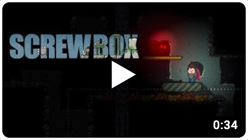
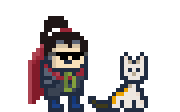

Minimalist 2d Java game engine. Result of covid lockdown.

[](https://search.maven.org/artifact/io.github.srcimon/screwbox)
[](https://github.com/srcimon/screwbox/actions/workflows/build.yml)
[](https://sonarcloud.io/summary/new_code?id=srcimon_screwbox)
[](https://sonarcloud.io/summary/new_code?id=srcimon_screwbox)

## About

ScrewBox is a personal pet project since february 2021. I use it to learn about Java and have some fun. Maybe you have a
look if you want to have some fun with Java and 2d graphics.

<p align="center"><a href="https://www.youtube.com/watch?v=fg5MJDx78SQ)"></a>
<br/><b><a href="https://www.youtube.com/watch?v=fg5MJDx78SQ)">▶ Watch trailer on Youtube</a></b></p>

## Features

- **Entity Component System** Add and remove game objects and behaviour. Save and load the game state.
- **Render Engine** Fast rendering of shapes, animated graphics and text. Enhance graphics with dynamic light and shadow
  effects.
- **Physics System** Move objects and resolve collisions. Detect objects via raycasting.
- **Asset Management** Load game assets without interrupting the game.
- **Basic UI** Create an animated interactive game ui in an instant.
- **Input Support** Receive player interactions via keyboard and mouse.
- **Game Scenes** Use scenes to structure different game situations.
- **Audio Support** Play wav and midi sounds. Control the volume. Thats it. Only the basics.
- **Support for Tiled Editior** Import your game map and tilesets in Json format from
  the [Tiled Editor](https://www.mapeditor.org)

## Getting started

1. Create a new Maven project and add `screwbox-core` dependency (Java 21 required):

    ``` xml
    <dependency>
        <groupId>io.github.srcimon</groupId>
        <artifactId>screwbox-core</artifactId>
        <version>1.0.0-RC2</version>
    </dependency>
    ```

2. Create new class and run (JVM option `-Dsun.java2d.opengl=true` highly recommended)

    ``` java
    import io.github.srcimon.screwbox.core.Engine;
    import io.github.srcimon.screwbox.core.ScrewBox;
    import io.github.srcimon.screwbox.core.graphics.Color;
    import io.github.srcimon.screwbox.core.graphics.Offset;
    import io.github.srcimon.screwbox.core.graphics.Pixelfont;
    
    public class HelloWorld {
    
        public static void main(String[] args) {
            Engine screwBox = ScrewBox.createEngine("Hello World Example");
    
            screwBox.environment().addSystem(engine -> {
                Offset offset = engine.mouse().offset();
                Pixelfont font = Pixelfont.defaultFont();
                engine.graphics().screen().drawTextCentered(offset, "HELLO WORLD!", font, 4);
            });
    
            screwBox.start();
        }
    }
    ```

## Modules

Here is a quick overview over all modules contained in this library:

### screwbox

BOM to manage all library dependencies.

``` xml
<dependencyManagement>
    <dependencies>
        <dependency>
            <groupId>io.github.srcimon</groupId>
            <artifactId>screwbox</artifactId>
            <version>1.0.0-RC2</version>
            <type>pom</type>
            <scope>import</scope>
        </dependency>
    </dependencies>
</dependencyManagement>
```

### screwbox-core

Adds the core functionality of the engine. Nothing more needed to make game.

``` xml
<dependency>
    <groupId>io.github.srcimon</groupId>
    <artifactId>screwbox-core</artifactId>
</dependency>
```

``` java
// creating a fancy black window
ScrewBox.createEngine().start();
```

### screwbox-tiled

Adds support for tilesets and maps made with [Tiled Editor](https://www.mapeditor.org). For real code have a look at
the [pathfinding example application](./screwbox-examples/pathfinding-example).

``` xml
<dependency>
    <groupId>io.github.srcimon</groupId>
    <artifactId>screwbox-tiled</artifactId>
</dependency>
```

``` java
// loading a map made with Tiled Editor
Map map = Map.fromJson("underworld_map.json");
```

### screwbox-examples

A list of some example projects showing how to use this engine:

- **[hello-world-example](./screwbox-examples/hello-world-example)** A very simplistic hello world application.
- **[pathfinding-example](./screwbox-examples/pathfinding-example)** example showing how to use pathfinding and
  importing maps from [Tiled Editor](https://www.mapeditor.org)
- **[game-of-life-example](./screwbox-examples/game-of-life-example)** An interactive game of life implementation.
- **[platformer-example](./screwbox-examples/platformer-example)** A much more complex example showing how to make a
  platformer game with some light and reflection effects.

## Libraries used

- JUnit [Eclipse Public License 2.0](https://github.com/junit-team/junit5/blob/main/LICENSE.md)
- FasterXML Jackson Core [Apache License 2.0](https://github.com/FasterXML/jackson-core/blob/2.14/LICENSE)
- AssertJ [Apache License 2.0](https://github.com/assertj/assertj-core/blob/main/LICENSE.txt)
- Mockito [MIT License](https://github.com/mockito/mockito/blob/main/LICENSE)

## Future ideas and plans

- [ ] add game example like [in this video](https://www.youtube.com/watch?v=GDoBw1ogFZY)
- [ ] add effects that can be applied to `Frame`s to create an animation (wind on foliage, water)
- [ ] add `LightDebugSystem`
- [ ] add `window.openDebugMenu()` allows change of scenes
- [ ] add small `Pixelfont` (crop transparent image area)
- [ ] add menu bar

## Acknowledgments

The project idea was inspired by Gurkenlabs [Litiengine](https://github.com/gurkenlabs/litiengine).

<p align="center"></p>
