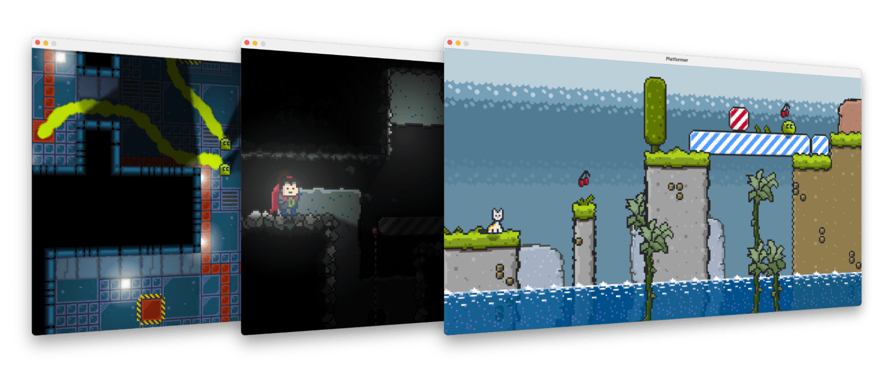

[](https://search.maven.org/artifact/io.github.srcimon/screwbox)
[](https://javadoc.io/doc/io.github.srcimon/screwbox-core)
[](https://github.com/srcimon/screwbox/actions/workflows/build.yml)
[](https://sonarcloud.io/summary/new_code?id=srcimon_screwbox)
[](https://sonarcloud.io/summary/new_code?id=srcimon_screwbox)

## About

ScrewBox is a minimalist pure Java game engine.
If you want to start building your own 2D game without leaving your cozy IDE it might be a fun choice.

ScrewBox uses a purely code based approach on creating games to not force you into using a proprietary content editor.
Learn more about the ScrewBox game engine at **[screwbox.dev](https://screwbox.dev)**.

``` xml
<dependency>
  <groupId>io.github.srcimon</groupId>
  <artifactId>screwbox-core</artifactId>
  <version>2.13.0</version>
</dependency>
```

``` java
public static void main(String[] args) {
    Engine screwBox = ScrewBox.createEngine("Hello World");

    screwBox.environment()
            .enableAllFeatures()
            .addEntity(
                    new CursorAttachmentComponent(),
                    new RenderComponent(SpriteBundle.BOX_STRIPED),
                    new TransformComponent());

    screwBox.start();
}
```

<p align="center"><a href="https://screwbox.dev"></a></p>

## Libraries used

- JUnit [Eclipse Public License 2.0](https://github.com/junit-team/junit5/blob/main/LICENSE.md)
- FasterXML Jackson Core [Apache License 2.0](https://github.com/FasterXML/jackson-core/blob/2.14/LICENSE)
- AssertJ [Apache License 2.0](https://github.com/assertj/assertj-core/blob/main/LICENSE.txt)
- Mockito [MIT License](https://github.com/mockito/mockito/blob/main/LICENSE)
- Docusaurus [MIT License](https://github.com/facebook/docusaurus/blob/main/LICENSE)
- Docusaurus Search Local Plugin [MIT License](https://github.com/easyops-cn/docusaurus-search-local?tab=MIT-1-ov-file#readme)

## Acknowledgments

The project idea was inspired by Gurkenlabs [Litiengine](https://github.com/gurkenlabs/litiengine).

<p align="center"></p>
