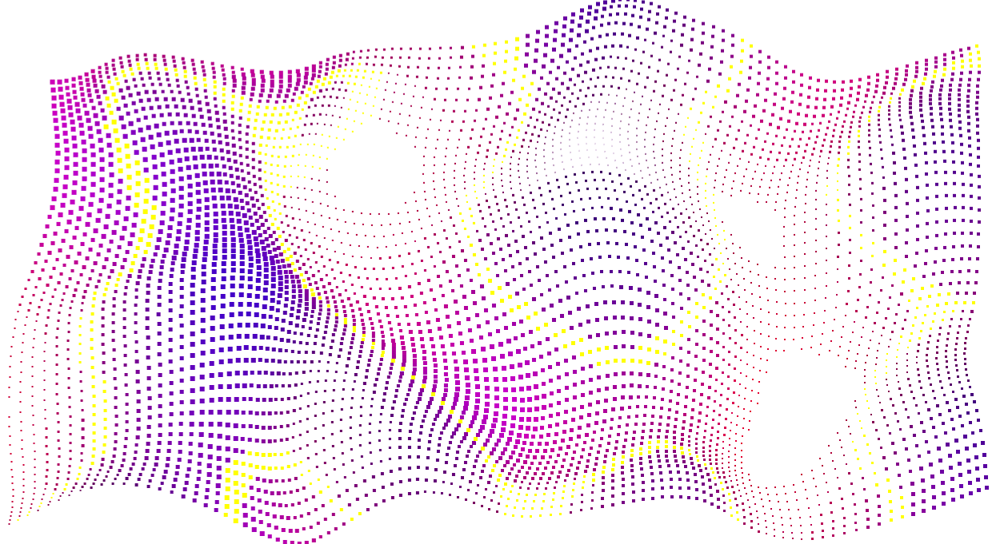
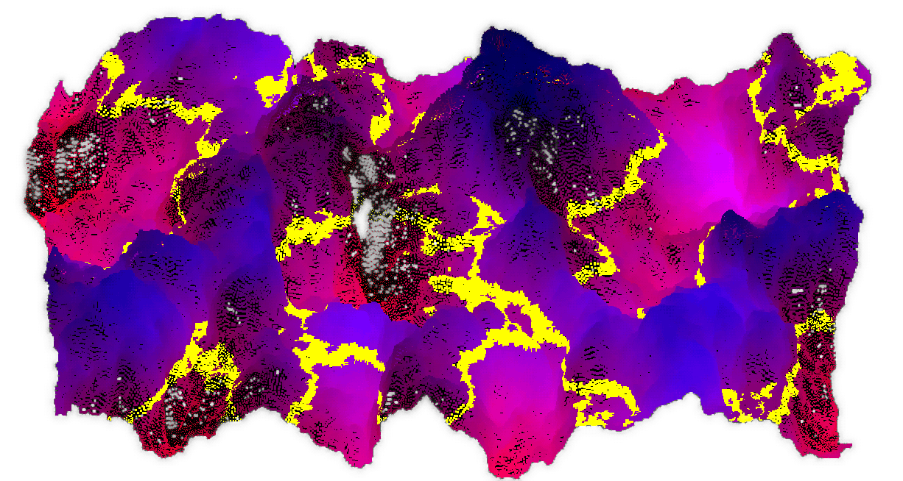

Greetings!
Version [3.4.0](https://github.com/srcimon/screwbox/releases/tag/3.4.0) of ScrewBox added support for generating
[Perlin Noise](https://en.wikipedia.org/wiki/Perlin_noise) and fractal noise.
Both algorithms can be used to generate infinite deterministic landscapes
and are commonly used in games like Minecraft or whenever 'procedural generation' is mentioned.
The next minor version of ScrewBox will also add support for three dimensional Perlin Noise.



ScrewBox is a game engine designed for creating 2D content,
so the third dimension used for generating noise will most likely be time.
Nonetheless, you can also create some pseudo 3D content using these utilities, as seen in the example screenshots.
The second one is a three-dimensional fractal noise which looks quite cool but doesn't add much value to the engine
because it's so slow and I cannot imagine any actual use but creating nice looking blog post illustrations.




Generating noise is quite easy. Enjoy!

``` java
// 2D noise
PerlinNoise.generatePerlinNoise(seed, x, y); // value in range -1 to 1

// 3D noise
PerlinNoise.generatePerlinNoise3d(seed, x, y, z); // value in range -1 to 1
```

### Update July 26, 2025

After massively improving the performance of noise generation (10 times faster!) version 3.6.0 will also ship
3d Fractal Noise generation. Because, why not?

<!-- truncate -->