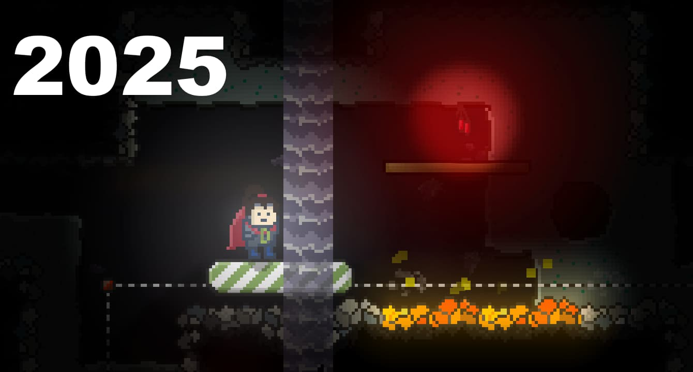

Hey there! I’ve just dropped version 3.9.0.
This version adds support for drawing arcs, expands the options for drawing rectangles and uses the new options to add enhanced light effects.
Expanded light areas also support lens flare effects now.
Looking back on some old screenshots it really makes me smile.
ScrewBox graphics made a huge leap since I started in 2021.

The new version also comes with a lot of useful minor features and fixes.
For all features have a look at the [full changelog](https://github.com/srcimon/screwbox/releases/tag/3.9.0).
I will concentrate on adding even more light effects for expanded light areas in the next version(s).