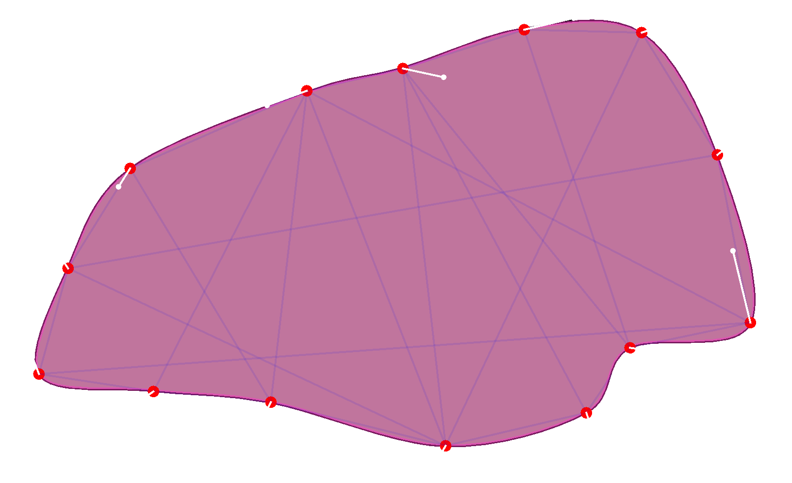

Hi there,

the last big contribution to ScrewBox in 2025 is in.
Version 3.18.0 will release three major updates to the soft body physics.

1. Soft bodies now support collisions using point in polygon and bisector intrusion algorithm. So your soft bodies now
   can interact with each other quite nicely.
2. The shape of the soft body can now be preserved using shape matching. This will prevent collapsing of the original
   shape and will be essential when using more complex shapes.
3. Pressure can be applied to soft bodies. So you can blow them up like balloons, because why not?

I have updated the [soft physics guide](/docs/guides/soft-physics) accordingly.

<!-- truncate -->