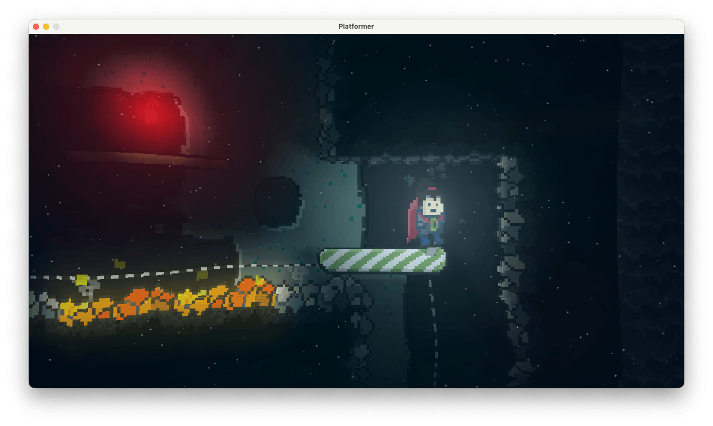

Hi everyone,

version 3.24.0 adds Post-Processing to ScrewBox games!

What is Post-Processing?
Instead of rendering directly to the screen, the engine now renders the scene into a buffer first.
The render pipeline then apply on ore more visual filters to that image before it is presented at the actual screen.
There are already some filters available in the current release: `Shockwave`, `Wave`, `DeepSea`, `Underwater`, `FishEye`, `FacetEye`, `HeatHaze` and `Warp`

Of course you can add your own filters.
Post-Processing filters can change the apperance of the game drastically.
Filters can be stacked even if this is quite limited due to the huge performance impact some of these filters can have.



The shockwave Post-Processing filter holds a unique position among these.
Unlike standard filters that apply to the entire screen, shockwaves should be created within the game world and move with camera movement.
Also the waves change their radius and width over time.
Because of this complexity, ScrewBox provides a specialized API for them.
The API lets you create shock waves in a single line of code.
The filter that renderes the waves will be created and applie internally on demand.

``` java
postProcessing.triggerShockwave($(10, 20), ShockwaveOptions.radius(40));
```

I'm planning to add some more support for such game world dependent effects in the future.
Also there are more post filters to come with the next versions.

Have a nice day!

<!-- truncate -->