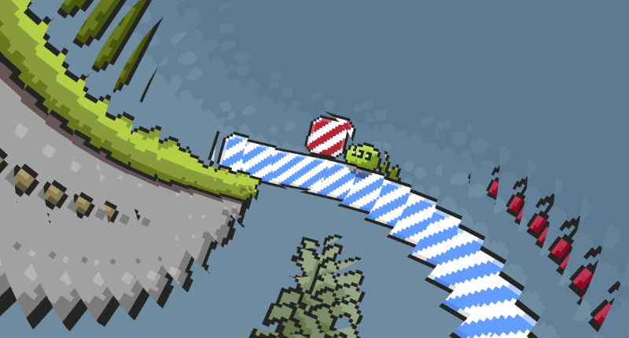

ScrewBox 3.26.0 uses the newly implemented post processing effects to create much better scene transitions.
Transitions can now use the current screen image as input instead of simply drawing on top of the screen.
I have replaced all the old animations with a bunch of new ones.
This is a screenshot for the new `CameraLensAnimation` which can be used for intro and outro animations:

This version also adds the `SoftBodyBoundaryComponent` which finally adds enhanced collision avoidance between the
softbody outline and the landscape.

<!-- truncate -->