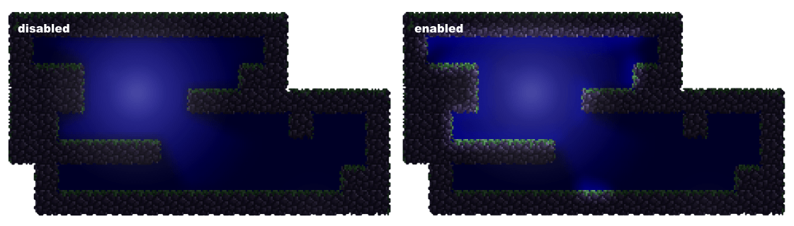

Lighting defines the atmosphere of a game.
While ScrewBox is still struggling with colored lights, it is now possible to use indirect light.
This new feature is enabled by default comming with 3.30.0.
Under the hood, the engine casts 180 rays around each visible spot light to calculate the bounces (and child bounces).
Consequently, all spotlights and cone lights create realistic indirect light when hitting occluders, illuminating adjacent walls.
This adds some visual depth to the environment.

Because all light sources in ScrewBox are dynamic, these raycasts and light bounces update constantly as the sources move.
There are new configuration options to turn off indirect light or customize it further.
For instance, the maximum number of bounces can be limited via the graphics configuration.

However, adding indirect light can be costly.
In my playground scene, this heavy raycasting reduced the framerate by at least 20 percent when running uncapped.
Despite the performance hit, I think it is absolutely worth it.

For more details please consider the [graphics documentation](docs/core-modules/graphics/#indirect-lighting).

<!-- truncate -->