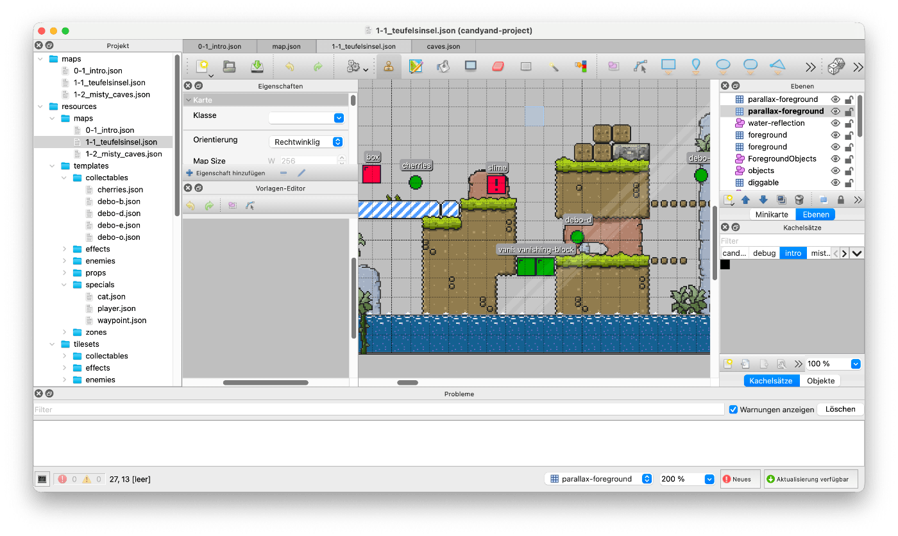

# Tiled Editor

ScrewBox supports importing maps and tilesets from [Tiled Editor](https://www.mapeditor.org).
Tiled Editor has a [large community](https://github.com/mapeditor/tiled) and is quite well known and already used in more professional projects.
Learn more on the [official site](https://www.mapeditor.org) of the project or have a look at this [tutorial series on youtube](https://www.youtube.com/playlist?list=PLu4oc9P-ABcOXNOyoAvnMyUwn_kkiVA5B).



## Project setup

To use this functionality please add the `screwbox-tiled` dependency to your project:

``` xml
<dependency>
    <groupId>dev.screwbox</groupId>
    <artifactId>screwbox-tiled</artifactId>
    <version><!-- same as screwbox-core --></version>
</dependency>
```

After adding the dependency content from Tiled Editor can be imported.

## Importing maps

Importing the map file is quite simple.
The `fromJson`-method will import the map from the resource folder of the game (`src/main/resources`).
Currently the supported formats are quite limited.
ScrewBox only supports orthogonal maps in json file format.
If you are in need of any other map format please [let me know](https://github.com/srcimon/screwbox/issues).

See this example code for better understanding:

``` java
Map map = Map.fromJson(mapName);

var tiles = map.tiles(); // returns all game tiles 
var layers = map.layers(); // returns all layers
var order = layers.getFirst().order(); // returns the (draw) order of the layer
```

Of cause you can also make use of the import API using entity blueprints when adding entities to the environment.

``` java
screwBox.environment()
    .importSource(ImportOptions.indexedSources(map.objects(), GameObject::name)
        .assign("deathpit", new DeathPit())
        .assign("player", new Player())
        .assign("spawnpoint", new SpawnPoint())
        .assign("light", new Light())
        .assign("wall", new Wall())
    );
```

These two example projects also make use of the Tiled editor support and the import API:

- [platformer](https://github.com/srcimon/screwbox/tree/main/examples/platformer)
- [vacuum-outlaw](https://github.com/srcimon/screwbox/tree/main/examples/vacuum-outlaw)

## Importing tilesets

Importing tilesets works quite similar.
The tilesets can be loaded directly from the resource folder.
It's recommended to address tiles within the tileset by the `type` attribute.
To fetch a tile by this attribute query the tileset by name.

``` java
Tileset player = Tileset.fromJson("tilesets/player.json")
Sprite standing = player.findByName("standing");

Sprite explosion = Tileset.spriteFromJson("bomb.json", "explosion");
```

Tilesets also support lazy loading using [Assets](../../core-modules/assets.md) to improve start up times.