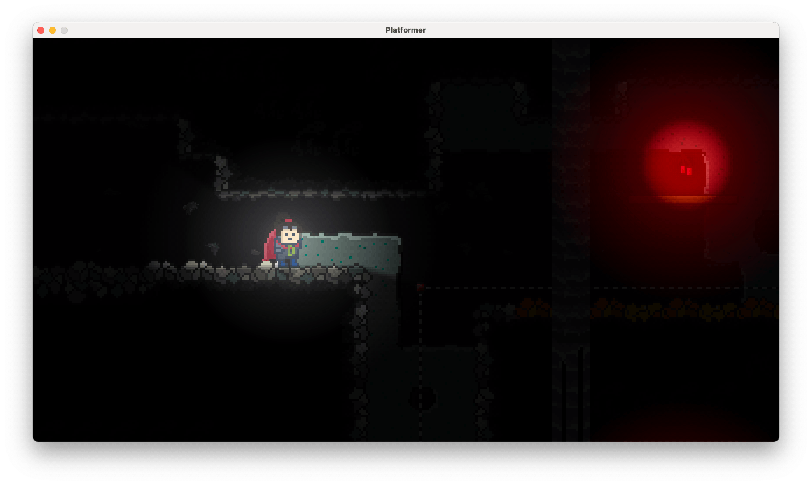
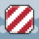
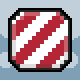
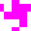
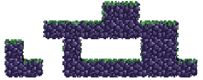

# Graphics

The `Graphics` module provides access to all drawing related topics within the engine.
Because the `Graphics` module is the biggest and most powerful module it provides multiple sub modules for different
graphic related tasks.

## Basics

This section describes the basic concepts and datatypes used when working with graphics in ScrewBox.

### Coordinates

The `Graphics` module uses a pixel-perfect coordinate system based on an `Offset`
, which represents the distance from the upper-left pixel on the screen, `Size`, which is used to describe the dimension
of any screen-related object, and `ScreenBounds`, which describes the combination of both, an area anywhere on the
screen.

### Sort order

Drawing sort order plays a major role when handling game graphics.
Game objects should be rendered in foreground of the floor.
An fps counter should always be rendered in from of the game world.
In an orthographic perspective the player might be rendered in front or in the back of a tree depending on his position.

The rendering order is influenced by the following parameters:

- **drawingOrder** property provided by all drawing options.
  This property is the most powerful tool to specify the drawing order of all drawing tasks.
  Default value is 0.

- **entity system order** When no drawingOrder is specified, the execution order of the `EntitySystem` will
  automatically set an offset to the drawing order.
  Every value in the `Oder` enum is spaced by 1,000,000 from another.
  Drawing tasks are therefor executed in order of the execution order of the `EntitySystem`.

- **call order**
  Multiple drawing tasks with the same drawing order from within the same `EntitySystem` will be executed
  in the order of code execution.

- **z-index** To support sorting within the same draw order `SpriteDrawOptions` provide this secondary sorting
  parameter.
  The z-index will automatically be set when setting `isSortOrthographic=true` in the `RenderComponent`.
  Of cause you can also specify custom values.

#### Best practices for drawing order:

- Specify the execution order of the entity system that you are working on accordingly. E.g. use `Order.PRESENTATION_UI`
  when the system handles ui rendering.

- Simply order your drawing calls within a method in the correct order.

- Specify draw order when necessary and avoid it otherwise.

- If you want to create drawing tasks across multiple execution orders specify the draw order and use the mixin function
  to calculate draw order value from another execution order.

- Use the maximum vertical y position as z-index or use the built in `RenderComponent` mechanism when handle
  orthographic rendering.

Use this examples for a better understanding:

| execution order            | specified order | resulting order | call order | z-Index | actual rendering order                              |
|----------------------------|-----------------|-----------------|------------|---------|-----------------------------------------------------|
| `Order.PRESENTATION_WORLD` | 0               | 7,000,000       | 1          | -       | 1 (lowest resulting order)                          |
| `Order.PRESENTATION_WORLD` | 1               | 7,000,001       | 1          | -       | 2                                                   |
| `Order.PRESENTATION_WORLD` | 2               | 7,000,002       | 1          | -       | 3                                                   |
| `Order.PRESENTATION_WORLD` | 2               | 7,000,002       | 2          | 50      | 5                                                   |
| `Order.PRESENTATION_WORLD` | 2               | 7,000,002       | 2          | 40      | 4 (because of lower z-Index)                        |
| `Order.PRESENTATION_LIGHT` | 25              | 9,000,025       | 1          | -       | 6                                                   |
| `Order.PRESENTATION_LIGHT` | 25              | 9,000,025       | 2          | -       | 7 (second drawing call with same order and z-index) |

Drawing across different execution orders needs calculating the order of the drawing call manually.
To do so simply use the helper method from the `Order` enum:

``` java
// will result in a draw order 1 above the light layer
int drawOrder = Order.PRESENTATION_LIGHT.mixinDrawOrder(1);
canvas.drawLine(line, LineDrawOptions.color(RED).drawOrder(drawOrder));
```

### Sprites and Frames

By far the most important class when adding graphics to your game will be sprites.
A `Sprite` is a still or animated image.
The single images contained in a `Sprite` are frames.
Every frame can use an individual showing duration.
The sprite will be rendered as infinite loop of it's frames.
Any sprite will need at leas one `Frame`.
To create a sprite add one ore more resource images into your `src/main/resource` folder and load the image as shown
below.
Also you can use any sprite from the SpriteBundle (see [Asset Bundle](../assets.md#asset-bundles)) to get started right
away.
If you just need a placeholder image there is a special method to create a prototype sprite in any specified size.

``` java
// create a sprite with a single image
Sprite player = Sprite.fromFile("player.png");

// create an animated sprite from a single image
Sprite playerWalking = Sprite.animatedAssetFromFile("player_walking.png", Size.square(16), Duration.ofMillis(100));

// use a pre defined sprite shipped with the engine
Sprite dot = SpriteBundle.DOT_RED.get();

// create a 10x40 pixels placeholder graphic
Sprite placeholder = Sprite.placeholder(Color.RED, Size.of(10, 40))
```

:::info
Sprites should only be created once and be reused when possible.
This will reduce cpu load an waiting times, especially when using shaders.
Background loading is also supported using [Assets](../assets.md).
:::

## Graphics

The `Graphics` class itself provies access to the submodules but also adds a huge number of useful functions:

``` java
// returns list of supported resultions on the current os
graphics.supportedResolutions();

// returns list of supported font names on the current os
graphics.availableFonts(); 

// maps the position on the `Screen` to a position in the world
// also works when using split screen!
Vector worldPosition = graphics.toWorld(Offset.at(10, 20));

// enable split screen (see guide)
engine.graphics().enableSplitScreenMode(options);
```

## Configuration

`Graphics.configuration()` will allow customizing system load and quality.
Options that can be specified:

| Option             | Default    | Description                                                            |
|--------------------|------------|------------------------------------------------------------------------|
| resolution         | `1280:720` | window resolution, also screen resolution when using fullscreen        |
| isFullscreen       | `false`    | enable or disable fullscreen mode                                      |
| useAntialiasing    | `false`    | enable or disable antialiasing (performance heavy when drawing shapes) |
| isAutoEnableLight  | `true`     | auto enable light when interacting with light                          |
| lightQuality       | `0.25`     | specify the quality and performance impact for lights and shadows      |
| isLightEnabled     | `false`    | use light (will make screen black when no light source is present)     |
| isLensFlareEnabled | `true`     | specify, if light glow effects can cause lens flares on the camera     |
| lightBlur          | `3`        | specify the blurring of the light map                                  |
| lightFalloff       | `1.0`      | specify how lights will blur to darkness                               |
| backgroundColor    | `BLACK`    | specify the background color of the screen                             |
| overlayShader      | `-`        | specify a shader that is used on every sprite drawn                    |

:::info
Currently there is no way to preserve the configuration when quitting the game.
If you need this please tell me by commenting on https://github.com/srcimon/screwbox/issues/439.
:::

## Canvas

Use the `Graphics.canvas()` to draw directly to the screen.
Every frame the `Canvas` will be cleared again.
So every drawing task has to be repeated in every frame.

The `Canvas` has a lot of distinct drawing methods available.
Most of this drawing methods use an option object that contains all drawing options for the specific task.
This limits the number of parameters for the drawing method.
These option classes are immutable and use a builder pattern.
See examples:

``` java
// will fill the whole canvas with red
canvas.fillWith(Color.RED);

// will draw a small half transparent white rectangle
canvas.drawRectangle(Offset.at(10, 20), Size.of(10,4), RectangleDrawOptions.filled(Color.WHITE.opacity(0.5));

// will draw the player sprite image using double size
canvas.drawSprite(player, Offset.at(100, 10), SpriteDrawOptions.scaled(2));
```

## World

The `Graphics.world()` is similar to the `Canvas` but provides methods that can be used to simplify drawing
by using world coordinates instead of screen coordinates.
Using `World` is also recommended when using [Split screen](../../guides/split-screen/index.md).
`World` uses the `Camera` to bind a world to screen coordinates.

## Screen

The `Graphics.screen()` can be used to setup the actual drawing area on the game [Window](../window.md).
Also the `Screen` allows rotating the whole viewport.
This will result in a huge performance drop but may create some nice effects.
This is also used by the camera shake to apply the swing effect.

## Camera

Screwbox uses a viewport concept.
Within the game there is at least one viewport that has individual camera control.
[Enabling split screen](../../guides/split-screen) will create new viewports.
The camera of each viewport can be controlled individually.
To receive the current camera use `engine.graphics().camera()`.

### Automatic camera control

The simplest way to move the camera within the game world is to simply attach the camera to an entity.
This can be done by adding a `CameraTargetComponent` to the entity.
By changing the `viewportId` property you can select the target viewport for the camera.
This is only relevant when using split screen.
To restrict the camera movement within a certain area, add a new entity containing a `TransformComponent` to specify the
area and a `CameraBoundsComponent`.

Don't forget to enable processing of the `CameraTargetComponent` by calling `environment.enableAllFeatures()`.

### Manual camera control

You can also obtain manual `Camera` controls using `engine.graphics().camera()`.
This allows some more specific controls like changing zoom or instant movement to a specified position.

:::info

Sadly you cannot set any zoom value.
This is due to zoom restriction which can also be changed via `Camera`,
but also pixel perfect mechanism that is in place to prevent graphic glitches.

:::

### Camera shake

`Camera` also allows setting of a short or infinite shake effect.
The method uses the specified `CameraShakeOptions` to apply the effect.
See example code:

``` java
camera.shake(CameraShakeOptions
    .lastingForDuration(Duration.oneSecond())
    .strength(4)
    .ease(Ease.SINE_IN_OUT)
    .swing(Rotation.degrees(10)));
```

The shake effect won't affect the position of the `Camera`.
To receive the actual position including the camera shake use `camera.focus()`.

## Light

You can also add light to the game scene by adding lights manually or automated.
When adding your first light or occluder this will result in automatically activating light rendering which
could lead to a black screen when the light is currently not in the viewing area.
To avoid this you can disable the auto activation using the `GraphicsConfiguration`.
To add lights manually use `Graphics.light()`.
This class also allows specifying the ambient light value that can be important when you only want to add a
little dynamic to the scene without darken it too much.
You can use the `Light` class directly for adding lights and shadows:

``` java
graphics().light().addPointLight(position, 40, Color.BLACK);
```



The following types of lights and shadows are supported:

| Type              | Description                                                                                         |
|-------------------|-----------------------------------------------------------------------------------------------------|
| cone light        | a directed light cone that will be affected by occluders                                            |
| point light       | a radial light source that will be affected by occluders                                            |
| spot light        | a radial light source that won't be affected by occluders                                           |
| occluder          | area that cast shadows and also can block lights when rendered on top                               |
| orthographic wall | an orthographic wall that can be illuminated but will cast shadows (used in common rpg perspective) |
| area light        | a area light effect                                                                                 |
| area glow         | a area glow effect                                                                                  |
| ambient light     | specifies maximum darkness of the whole screen                                                      |
| light glow        | a glow effect that doesn't illuminate the area                                                      |

::::tip
It's highly recommended to add the `StaticOccluderComponent` to any shadow casting entity that will not move to
massively
improve rendering performance.
::::

The recommended way to add light to your scenes is by using the corresponding components of the ecs.
See [Components Overview](../../reference/components-overview.md).

### On light colors

Creating light in a 2D Java game engine was not an easy task.
Light is created by drawing a separate transparent image with the black gradient shapes.
Which is then inverted, blurred and scaled to create some kind of immersive light effect.

This is not how light works at all in the real world or any other game engine I know.
So to avoid graphic glitches it is recommended to draw only black light sources.
(With exception of glow lights, which are actually drawn on top of the image.)
Any other color might work but may result in some quite ugly graphics.
This is kind of strange and will likely change in the future.

### Drawing on top of light

In some cases it might be necessary to draw sprites on top of the light map.
To do so, simply set the `renderInForeground` property of your `RenderComponent`.

### Creating immersive light sources

To create really immersive light sources, the combination of distinct light components might be very useful.
For example:

- Add a `PointLightComponent` to create the basic light source which creates dynamic shadows.
- Add a `SpotLightComponent` to also lighten areas that would otherwise be not visible at all.
- Add a `GlowComponent` to highlight the light source.
- Add a `LensFlare` to the `GlowComponent` to create some basic reflections on the screen.

## Advanced topics

### Automate drawing using the ecs

The recommended way to draw `Sprites` in your game is by adding a `RenderComponent` to your game entities.
The rendering of entities using this component is massively optimized for best performance and will also support
reflection effects using the `ReflectionComponent`.
This example code will add a red image attached to the mouse cursor.

``` java
engine.environment()
    .enableRendering()
    .addEntity(new Entity("animated cursor")
        .add(new RenderComponent(SpriteBundle.DOT_RED))
        .add(new TransformComponent())
        .add(new CursorAttachmentComponent()));
```

### Reflections

To add reflections simply add a `ReflectionComponent` to any entity that will act as a mirror and reflect everything
above.
Only entities using the `RenderComponent` will be reflected.
The `ReflectionComponent` also supports to different kinds of animation: projection and postfilter.

### Shaders

When rendering a `Sprite` using the `RenderComponent` or by manual drawing on the `Canvas` you can specify
`SpriteDrawOptions` to customize the drawing process.
`SpriteDrawOptions` allow scaling, rotating, flipping the drawing.
But they also allow specifying a `Shader`.
Shaders will create animated images from any source (animated or still).
They have their own customization class named `ShaderSetup` to customize the animation.
ScrewBox ships some pre defined shaders. (See [Shaders](../../reference/shaders/index.md)).

Shaders will animate the sprite on the fly, but will reuse the calculated images once they are created.
This process is quite cpu heavy and should be done upfront before entering a [Scene](../scenes.md#loading-scene).
To prepare a shader upfront use `compileShader`.
So to animate your cursor from the example code just add the shader:

``` java
var sprite = SpriteBundle.DOT_RED.compileShader(ShaderBundle.IRIS_SHOT);
var options = SpriteDrawOptions.originalSize().shader(ShaderBundle.IRIS_SHOT);

engine.environment()
    .enableRendering()
    .addEntity(new Entity("animated cursor")
        .add(new RenderComponent(sprite, options)
        .add(new TransformComponent())
        .add(new CursorAttachmentComponent()));
```

Some examples for a still image animated using shaders. For a complete reference
see [Shaders](../../reference/shaders/index.md).





### Auto tiling

Auto tiling uses a predefined set of sprites to automatically detect the correct sprite for a certain tile in your game
map.
Auto tiling is quite easy when using an `TileMap` for creating your level or prototype.
First of create your `AutoTile` by copying one of the auto tile layout templates into your own game resources.
Currently there are two layouts available:

| Layout                                                                                                                                                                         | Preview                                                                                          |
|--------------------------------------------------------------------------------------------------------------------------------------------------------------------------------|--------------------------------------------------------------------------------------------------|
| 2x2 layout using less layout using 16 sprites ([download](https://github.com/srcimon/screwbox/blob/master/screwbox-core/src/main/resources/assets/autotiles/template_2x2.png)) |  |
| 3x3 detailed layout using 47 sprites ([download](https://github.com/srcimon/screwbox/blob/master/screwbox-core/src/main/resources/assets/autotiles/template_3x3.png))          |  |

Then paint on that sprite sheet and create an AutoTile using the `Layout` matching the template you used.
To get the sprite just query the `AutoTile` you are using with a auto tile index from the `TileMap.Tile`.
If you want to experiment with that feature you can also use one of the pre packed auto tiles using `AutoTileBundle`.

It is also possible to update sprites during runtime by adding an `AutoTileComponent` to your entity.

But you can easily create a mask on your own by specifying an on predicated to test if a tile is connected.

``` java title="create a mask for connected tiles"
final var mask = AutoTile.createMask(tileOffset, 
    location -> entry.getValue().equals(directory.get(location)));
```

``` java title="using auto tiling with with TileMap"
final var map = TileMap.fromString("""
        ##
     #######
   #  #   ##
   ## #######
   """);
                   
environment.importSource(map.tiles())
    .usingIndex(TileMap.Tile::value)
    .when('#').as(tile -> new Entity()
            .bounds(tile.bounds())
            .add(new RenderComponent(tile.findSprite(AutoTileBundle.ROCKS))));
```

The above code example will result in a map looking like:

