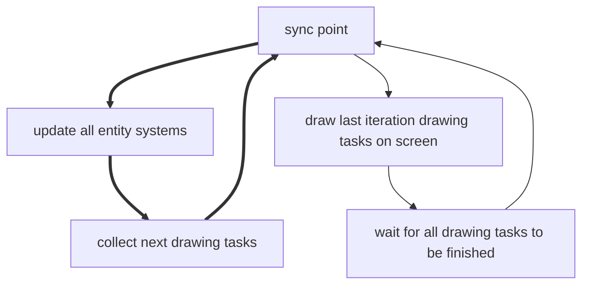

# Loop

The game loop is responsible for updating all core modules.
The `engine.loop()` module provides access to current performance metrics and to controls the target frames per second.

## Frame rate (fps)

The game `Loop` tries to create a constant frame rate.
The default frame rate is 120 frames per second.
This means there are 120 updates of every `EntitySystem` in the `Environment` and the game screen is also rendered 120 times a second.
The frame rate can be changed to any other value above 120 fps.
Lower values are not possible.

``` java
// sets the new target fps
loop.setTargetFps(200);

// stops limiting the frame rate at all
// usefull for performance tests
loop.unlockFps();

// the actual current fps
final int fps = loop.fps();
```

:::info Why 120 fps?
ScrewBox uses no constant updates for the physics collision detection.
If there were too few updates of the physics system this would lead to glitches like falling through the floor etc.

Also not every frame that is rendered is actually shown on the monitor.
This is due to missing sync between the window that ScrewBox creates and the monitor.
:::

## Delta time

To keep the game at a constant speed independent from the actual fps the game loop provides a delta time value.
This value should be multiplied with anything that would otherwise create a non constant speed.

``` java
public class MovementSystem implements EntitySystem {
    
    @Override
    public void update(Engine engine) {
        for(final var entity : engine.environment().fetchAllHaving(TransformComponent.class)) {
            // ! entities would move faster on higher fps
            entity.moveBy(Vector.x(10)); 
            
            // constant movement
            entity.moveBy(Vector.x(engine.loop().delta() * 10)); 
            
            // same as above, but more compact
            entity.moveBy(Vector.x(engine.loop().delta(10))); 
        }
    }
}
```

## Game speed

The delta time values can be customized by setting the game speed using `loop.setSpeed(newSpeed)`.
This can be used to create slow motion effects.
But animation and sound playback speed won't be affected by this setting. 

## Game loop in depth

The ScrewBox game loop uses a separate thread for drawing on the screen.
This massively improves the frame rate.
Whenever an `EntitySystem` creates a drawing task this task is collected and stored by the renderer.
The renderer executes this drawing task then in the next frame.
Because 120 fps is a lot this cannot be recognized by the user.
The parallel threads won't affect your code.
But it's good to know that there can be two kinds off performance bottle necks:
- **drawing** Too many and too heavy drawing tasks may be the reason for low fps. Actually this will be the reason of most performance issues.
- **updating** Too heavy calculation may be the reason for low fps. When running into updating issues try to use the `Async` module to externalize heavy calculations in another thread.

The game loop in action:

