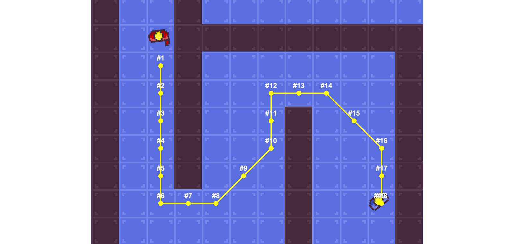

# Navigation

Check for line of sight, raycast for entities and find paths for enemy movement.

## Pathfinding

The navigation subsystem makes it easy to add pathfinding to your game using a tile grid.
To enable pathfinding, a region in the game world must be indexed as a navigation region, which includes all obstacles
that block the path.
To index a pathfinding region call the according method or simply add a `NavigationRegionComponent` to an entity:

``` java
// manually index a navigation region
navigation.setNavigationRegion(mapBounds, obstacles);

// automatically setup a constantly updated navigation region
environment
  .enableNavigation()
  .addEntity(new Entity("game-world")
    .bounds(mapBounds)
    .add(new NavigationRegionComponent()))
  .addEntity(new Entity("wall")
    .bounds(mapBounds)
    .add(new ObstacleComponent()));
```

Pathfinding will now be enabled within the indexed region.
However, if the start or end of your pathfinding requests does not reside within the region, you will not receive any
results.
When using the `NavigationRegionComponent` the region will be constantly updated.
The interval can be configured using the `updateInterval` property.
All entities that block the path are marked using the `ObstacleComponent`.



Now paths can be searched within the navigation region using `navigation.findPath(start, end)`.
The result will be an empty `Optional` when there was no path found.

### Configure pathfinding

Pathfinding and the underlying grid can be configured to create the wanted results.
This are the configuration options:

- **setCellSize** Configures the size of the pathfinding grid.
  Default value is 16. Higher numbers mean less accuracy, lower numbers mean higher cost of pathfinding.
  Entities bigger than cell size might also get stuck because the path is too narrow.
  It's recommended to use the same size as your tiles in tile based games.

- **setDiagonalMovementAllowed** Enables or disables diagonal movement in pathfinding.

- **setPathfindingAlgorithm** Configures the pathfinding algorithm used to calculate results.
  ScrewBox provides two algorithms out of the box: A* and Dijkstra.
  You can also add your own implementations.
  This setting is also used when using a custom pathfinding graph (see below).

- **setGraphCachingNodeLimit** Sets the maximum number of nodes for a pathfinding grid that will use caching.
  Default value is 40k.
  Caching reduces the costs for pathfinding but increases the cost of updating the pathfinding region.
  Caching will reduce cost of pathfinding by 10 to 30 percent.

### Custom graphs

The grid based pathfinding will satisfy most needs.
But the engine does not limit you to this approach.
You can add a custom implementation of the `Graph` interface to support any other kind of pathfinding, e.g. waypoint based pathfinding.
The `Graph` interfaces supports any type of object as node as long as you can translate from a node to a game world position.

``` java
Optional<Path> path = navigation.findPath(start, end, myWaypointGraph, new AStarAlgorithm());
```

### Path movement 

There is also a simple way to let your ai controlled entity move along a path.
Simply add a `PathMovementComponent` to a physics entity and it will automatically start moving along the path.

## Raycasting

The navigation system also provides methods for raycasting.
Raycasting can be used to check for ground collisions and can be very useful when creating an enemy ai
e.g. to check for line of sight.
The raycasting api is very likely to change in the future.
Please don’t be upset that the documentation lacks some depth in this section.

``` java
// select all enemies below the player
navigation.raycastFrom(playerPosition)
  .checkingFor(Archetype.ofSpacial(EnemyMarkerComponent.class))
  .castingVertical(20)
  .selectAllEntities();
```

## Entity search

There are also two methods to search for entities in at a certain position or a certain area within the game world.

``` java
// select any building located at the mouse position
navigation.searchAtPosition(engine.mouse().position())
  .checkingFor(Archetype.ofSpacial(BuildingComponent.class))
  .selectAny();
  
// select all buildings located within the specified region
navigation.searchAtPosition(engine.mouse().position())
  .checkingFor(Archetype.ofSpacial(BuildingComponent.class))
  .selectAny();
```