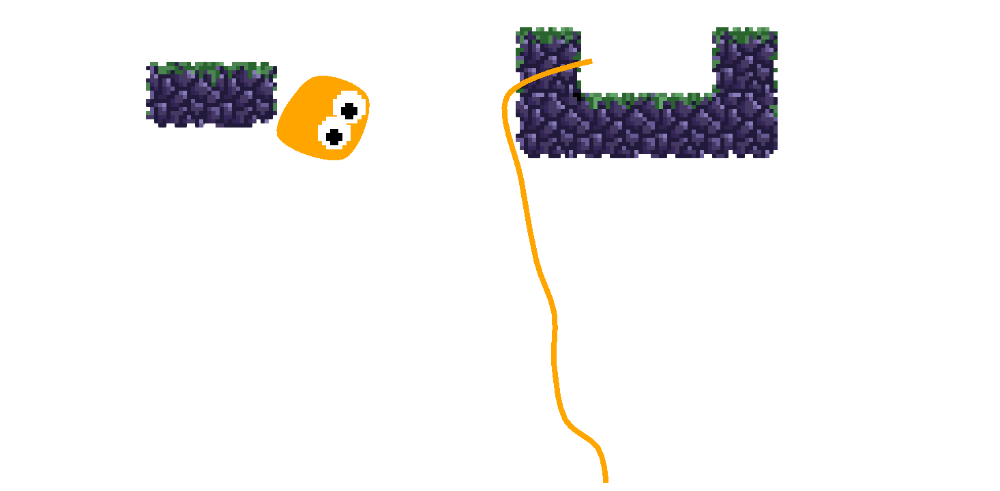
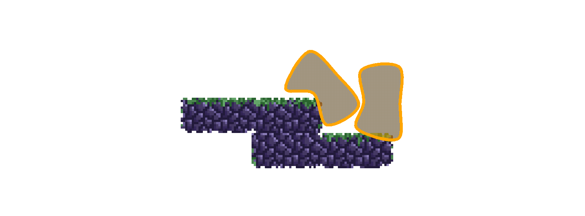

# Soft physics

:::info about this guide
This guide will explain how to use the different soft physics features to create ropes etc..
:::

## Basic concept

To create soft bodies of any kind there are currently two main components that are used to link multiple entities
together:

- `SoftLinkComponent` will link the containing entity with another. The target is specified by id within the component.
  The component is used by other components to create an outline for soft bodies.
- `SoftStructureComponent` will basically do the same but with multiple targets.
  The component is used to create structural integrity when creating a soft body from multiple entities.

## Ropes

To create a rope you can create a chain of entities each linking to the next one using the `SoftLinkComponent`.
To render the rope add a `RopeComponent` and a `RopeRenderComponent` to the first entity within the chain.
The `RopeComponent` will build a comfortable list of entities contained within the rope.
The `RopeRenderComponent` will actually render a smoothed line between the entities from the node list within the
`RopeComponent`.

## Soft Bodies

Creating soft bodies is similar to creating ropes.
Start by creating a loop of entities each linking to the next one using the `SoftLinkComponent`.
In contrast to building a rope the last element of the chain must link back to the first element.
To maintain the form of the shape you have created, add a `SoftStructureComponent` to some of the nodes and link
them to other ones.
The `SoftBodyComponent` will build a comfortable list of entities contained within the outline of the body.
The `SoftBodyRenderComponent` will actually render a polygon created by the the entities from the node list within the
`SoftBodyComponent`.

To add collisions between soft bodies add the `SoftbodyCollisionComponent` to all soft bodies that should collide
with each other.

:::note
Future versions will introduce apis for a more comfortable creation of ropes and soft bodies.
:::