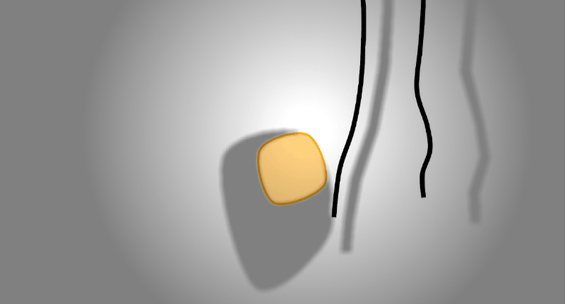

# Soft physics

:::info about this guide
This guide will explain the concept behind soft physics and how to create the different kind of soft physics entities.
:::

## Basic concept

To create soft bodies of any kind there are currently two main components that are used to link multiple entities
together:

- `SoftLinkComponent` will link the containing entity with another. The target is specified by id within the component.
  The component is used by other components to create an outline for soft bodies.
- `SoftStructureComponent` will basically do the same but with multiple targets.
  The component is used to create structural integrity when creating a soft body from multiple entities.

Both components specify the link length between the entities.
It is not required to specify the link length on entity creation, because they are automatically set when the entities
are processed by the `SoftPhysicsSystem`.
If one or more of the link node entities move before the link lengths are initialized, this might lead to unwanted
behavior.
Therefore it is recommended to explizitly set the link lengths.
The `SoftPhysicsSupport` class (see below) can automate the link length initialization.

## Soft physics entities

### Ropes

A rope is simply a chain of entities linking each other using the `SoftLinkComponent`.
To create a rope you can create a chain of entities each linking to the next one using the `SoftLinkComponent`.
To render the rope add a `RopeComponent` and a `RopeRenderComponent` to the first entity within the chain.
The `RopeComponent` will build a comfortable list of entities contained within the rope.
The `RopeRenderComponent` will actually render a smoothed line between the entities from the node list within the
`RopeComponent`.


The `SoftPhysicsSupport` helps with the rope creation.
The `createRope` method will create a linked list of prepared rope entities that you can customize further.
The return value is a specified list that simplyfies access to some 'special' entities within the rope.
The root entity will be the one containing the `RopeComponent`.
The end entity will not have a `SoftLinkComponent`.

``` java
// creates 8 linked entities
var rope = SoftPhysicsSupport.createRope($(4, 10), $(4, 50), 8, engine.environment());

// add rendering (.root() entity will contain the RopeComponent)
rope.root().add(new RopeRenderComponent(Color.MAGENTA, 2));

// customize the links flexibility
rope.forEach(node -> node.tryGet(SoftLinkComponent.class).ifPresent(link -> link.flexibility = 50));

// customize friction
rope.forEach(node -> node.get(PhysicsComponent.class).friction = 1);

// remove physics from the end node to make it fix
rope.end().remove(PhysicsComponent.class);
```

### Soft Bodies

Soft bodies are (rounded) closed polygons that can collide with each other which will create a 'jelly' effect.


Creating soft bodies is similar to creating ropes.
Start by creating a loop of entities each linking to the next one using the `SoftLinkComponent`.
In contrast to building a rope the last element of the chain must link back to the first element.

The `SoftBodyComponent` will build a comfortable list of entities contained within the outline of the body.
This component is also required to use other functionality e.g. rendering and shape matching.
The entity containing the `SoftBodyComponent` will be referred as the soft body entity.

The `SoftBodyRenderComponent` will actually render a polygon created by the the entities from the node list within the
`SoftBodyComponent`.

It is a lot easier to create soft bodies using the `SoftPhysicsSupport` class.
The support class can create soft bodies with and without structural integrity.
The result of the helper method will also be a specialized list that allows direct access to the root entity etc..

``` java
// creates a soft body with three nodes
var polygon = Polygon.ofNodes($(20, 2), $(40, 3), $(30, 20))
var softBody = SoftPhysicsSupport.createStabilizedSoftBody(polygon, environment);

// enables rendering
softBody.root().add(new SoftBodyRenderComponent(Color.ORANGE);

// adds all soft body entities to the environment
engine.environment().addEntities(softBody);
```

#### Preserving shape

To preserve the shape of the soft body you have created, add a `SoftStructureComponent` to some of the nodes and link
them to other ones.
This will add some basic structural integrity and works pretty well for some shapes.
If the soft body gets more complex the shape may quickly collapse in certain situations.
To preserve the original shape, simply add a `SoftBodyShapeComponent` to the soft body entity.
This component will add shape matching to the soft body which will instantly stabilize the original shape.
The component can be configured to disable rotation of the shape, if the goal is to keep the shape upright.
The component can also be configured to disable movement to fix the shape position as well.

::::warning
Adding a `SoftBodyShapeComponent` to an entity might lead to unwanted motion when entity shape is deformed by collision.
This sadly cannot be avoided.
But to mitigate the issue, try experimenting with entity friction and dead zone value of the shape component.
::::

This image visualizes the outline links, the soft structure links and the links between the soft body and the shape
matching one.


#### Soft body collisions

To add collisions between soft bodies add the `SoftBodyCollisionComponent` to all soft bodies that should collide
with each other.
Soft body collisions are far from perfect.
ScrewBox uses a mix of point in polygon and bisector ray collision preventions.
Collisions may add lots of momentum to the soft body.
Experiment with the different configuration properties of the `SoftStructureComponent`, `SoftLinkComponent` and the
`SoftBodyShapeComponent` to get the best results.

#### Expand size

To expand a soft body add ad `SoftbodyPressureComponent` and specify the pressure value, that you want to apply.
Avoid applying very low negative values because this will mess up the body when the structural integrity is lower
than the pressure.

### Cloth

Cloth entities are a special kind of soft body.
Cloth entities have an outline linked by `SoftLinkComponents`.
But they also have a mesh of additional entities within that are linked using `SoftStructureComponent`.
These internal links will provide a kind of cloth like integrity.
The root node will contain a `SoftBodyComponent` but also a `ClothComponent` that provides direct access to the mesh of
linked entities.


The `ClothRenderComponent` allows rendering of the cloth using a mesh shading algorithm to create a 3D like effect.
The rendering can be customized with textures, detail level and color.
Creating cloth is no fun.
To make it easier use the `SoftPhysicsSupport` class.

``` java
// creates the cloth entities using a 16 by 16 mesh
var cloth = SoftPhysicsSupport.createCloth(Bounds.$$(0,0,128,256), Size.of(16, 16), e.environment());

// add rendering of a flag with white background
cloth.root().add(new ClothRenderComponent(), x -> {
    x.texture = Sprite.fromFile("flag.png");
    x.backgroundColor = Color.WHITE;
});

// attach the top border of the flag to the game world 
cloth.topBorder().forEach(entity -> entity.remove(PhysicsComponent.class));
```

## Lighting

Soft physics objects also support creating backdrop shadows using the `RopeOccluderComponent` and `SoftBodyOccluderComponent`.
Because cloth soft bodies also contain a `SoftBodyComponent` they can also make use of the `SoftBodyOccluderComponent`.

Backdrop shadows are quite expensive and should be used with performance in mind, but the effect might be worth it.
To reduce the performance impact disable the rounding effect in the `ShadowOptions`.

