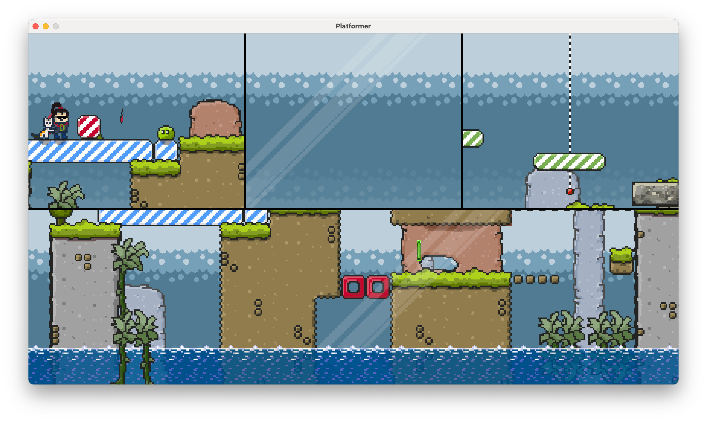

# Split Screen

You can create up to 64 split screen viewports to support local multiplayer games.
Actually you will only use two or four screens max for real world scenarios.

To enable split screen use the `Graphics.enableSplitScreenMode` method.
You can also specify the padding between the screens and set the layout you want to use.
You can also implement your own layouts if the existing ones don't fit your needs.

``` java
// enable 4 screens
engine.graphics().enableSplitScreenMode(SplitScreenOptions.viewports(4)
    .padding(8)
    .verticalLayout());
    
// back to single screen
engine.graphics().disableSplitScreenMode();
```



:::tip

To fully support split screen in your own game you have to repeat your custom drawing operations on every `Viewport` using `engine.graphics().viewports()`.
To avoid this it's recommended to use `Graphics.world()` for your custom drawing operations.

:::
