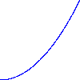

# Ease

Ease configures the direction and the progress of a value change.

## Usage example

There are lots of places that `Ease` can be used to enhance animations or transitions.
This code for example switches to the start scene of the game and uses an ease function make the outro animation more appealing.

``` java
scenes.switchTo(StartScene.class, SceneTransition.custom()
    .outroEase(Ease.SINE_IN)
    .outroAnimation(new CirclesAnimation())
    .outroDurationMillis(2000)
    .introDurationMillis(250));
```

## Overview

| Ease                    | Visualization                             |
|-------------------------|-------------------------------------------|
| `Ease.FLICKER`          |                    |
| `Ease.IN_PLATEAU`       |              |
| `Ease.IN_PLATEAU_OUT`   |      |
| `Ease.LINEAR_IN`        |                |
| `Ease.LINEAR_OUT`       |              |
| `Ease.PLATEAU_OUT`      |            |
| `Ease.PLATEAU_OUT_SLOW` |  |
| `Ease.SIN_IN_OUT_TWICE` |  |
| `Ease.SINE_IN`          |                    |
| `Ease.SINE_IN_OUT`      |            |
| `Ease.SINE_OUT`         |                  |
| `Ease.SPARKLE`          |                    |
| `Ease.SQUARE_IN`        |                |
| `Ease.SQUARE_OUT`       |              |
| `Ease.S_CURVE_IN`       |              |
| `Ease.S_CURVE_OUT`      |            |