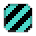

# Shaders

Shaders can be used to draw animated or still images with an applied effect.

## Usage example


The asset bundle class `ShaderBundle` contains some pre defined shaders for easy use. Most of those shaders can be
individualized even more using the `ShaderSetup` class.

``` java
// using bundled shader setup
canvas.drawSprite(SpriteBundle.BOX_STRIPED, engine.mouse().offset(), SpriteDrawOptions
    .originalSize()
    .shaderSetup(ShaderBundle.WATER));

// custom shader setup
    .shaderSetup(ShaderSetup.shader(new OutlineShader(Color.WHITE))));
```

## Overview


| Shader                             | Visualization                                   |
|------------------------------------|-------------------------------------------------|
| `ShaderBundle.BREEZE`              |                            |
| `ShaderBundle.GRAYSCALE`           |                      |
| `ShaderBundle.INVERT_COLORS`       |              |
| `ShaderBundle.FLASHING_RED`        |                |
| `ShaderBundle.FLASHING_WHITE`      |            |
| `ShaderBundle.WATER`               |                              |
| `ShaderBundle.WATER_COMICAL`       |              |
| `ShaderBundle.OUTLINE_PULSE_WHITE` |  |
| `ShaderBundle.OUTLINE_BLACK`       |              |
