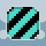

# Shaders

Shaders can be used to draw animated or still images with an applied effect.

## Usage example

``` java
canvas.drawSprite(SpriteBundle.BOX_STRIPED, engine.mouse().offset(), SpriteDrawOptions
    .originalSize()
    .shaderSetup(ShaderBundle.WATER));
```

## Overview

The asset bundle class `ShaderBundle` contains some pre defined shaders for easy use. Most of those shaders can be
individualized even more using the `ShaderSetup` class.


| Shader                        | Visualization                         |
|-------------------------------|---------------------------------------|
| `ShaderBundle.BREEZE`         |                  |
| `ShaderBundle.GRAYSCALE`      |            |
| `ShaderBundle.INVERT_COLORS`  |    |
| `ShaderBundle.FLASHING_RED`   |      |
| `ShaderBundle.FLASHING_WHITE` |  |
| `ShaderBundle.WATER`          |                    |
| `ShaderBundle.OUTLINE_BLACK`  |    |
