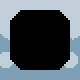

# Shaders

Shaders can be used to draw animated or still images with an applied effect.

## Usage example

The asset bundle class `ShaderBundle` contains some pre defined shaders for easy use. Most of those shaders can be
individualized even more using the `ShaderSetup` class.

``` java
// using bundled shader setup
canvas.drawSprite(SpriteBundle.BOX_STRIPED, engine.mouse().offset(), SpriteDrawOptions
    .originalSize()
    .shaderSetup(ShaderBundle.WATER));

// custom shader setup
    .shaderSetup(ShaderSetup.shader(new OutlineShader(Color.WHITE))));
```

## Overview

| Preview                                           | Shader                              |
|---------------------------------------------------|-------------------------------------|
|                                  | -                                   |
|                              | `ShaderBundle.BREEZE`               |
|                          | `ShaderBundle.DISSOLVE`             |
|                            | `ShaderBundle.SUNBURN`              |
|                            | `ShaderBundle.GAMEBOY`              |
|                          | `ShaderBundle.PIXELATE`             |
|                            | `ShaderBundle.FOLIAGE`              |
|                        | `ShaderBundle.GREYSCALE`            |
|                | `ShaderBundle.INVERT_COLORS`        |
|                        | `ShaderBundle.IRIS_SHOT`            |
|                            | `ShaderBundle.ALARMED`              |
|                      | `ShaderBundle.SILHOUETTE`           |
|                                  | `ShaderBundle.HURT`                 |
|                                | `ShaderBundle.WATER`                |
|                          | `ShaderBundle.SEAWATER`             |
|                          | `ShaderBundle.SELECTED`             |
|  | `ShaderBundle.CHROMATIC_ABERRATION` |
|                            | `ShaderBundle.OUTLINE`              |
