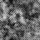
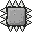
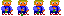
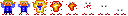
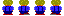
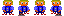
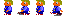
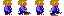
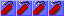
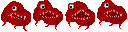

# Sprites

ScrewBox ships some Sprites for instant use. To obtain an instance simple use the corresponding enum value:

``` java
Sprite mySprite = SpriteBundle.BOX.get();
```

## Overview

| Ease                               | Visualization                                                                                |
|------------------------------------|----------------------------------------------------------------------------------------------|
| `SpriteBundle.ACHIEVEMENT`         |          |
| `SpriteBundle.BOX`                 |                  |
| `SpriteBundle.CLOUDS`              |               |
| `SpriteBundle.CRT_MONITOR_EDGE`    |     |
| `SpriteBundle.ICON`                |                 |
| `SpriteBundle.DOT_BLUE`            |             |
| `SpriteBundle.DOT_RED`             |              |
| `SpriteBundle.DOT_WHITE`           |            |
| `SpriteBundle.DOT_YELLOW`          |           |
| `SpriteBundle.SMOKE`               |                |
| `SpriteBundle.SPLASH`              |               |
| `SpriteBundle.SLIME_MOVING`        |         |
| `SpriteBundle.TNT_TICKING`         |          |
| `SpriteBundle.ELECTRICITY_SPARCLE` |  |
| `SpriteBundle.LEAVE_FALLING`       |        |
| `SpriteBundle.EXPLOSION`           |            |
| `SpriteBundle.FIRE`                |                 |
| `SpriteBundle.MAN_STAND`           |            |
| `SpriteBundle.MAN_DISSOLVE`        |         |
| `SpriteBundle.MAN_WALK_BACK`       |        |
| `SpriteBundle.MAN_WALK_FRONT`      |       |
| `SpriteBundle.MAN_WALK_LEFT`       |        |
| `SpriteBundle.MAN_WALK_RIGHT`      |       |
| `SpriteBundle.MARKER_TARGET`       |        |
| `SpriteBundle.MARKER_SHIELD`       |        |
| `SpriteBundle.MARKER_SKULL`        |         |
| `SpriteBundle.MARKER_CROSSHAIR`    |     |
| `SpriteBundle.MARKER_TNT`          |           |
| `SpriteBundle.MARKER_SPECIAL`      |       |
| `SpriteBundle.MONSTER_FLYING`      |       |
| `SpriteBundle.SHADER_PREVIEW`      |       |